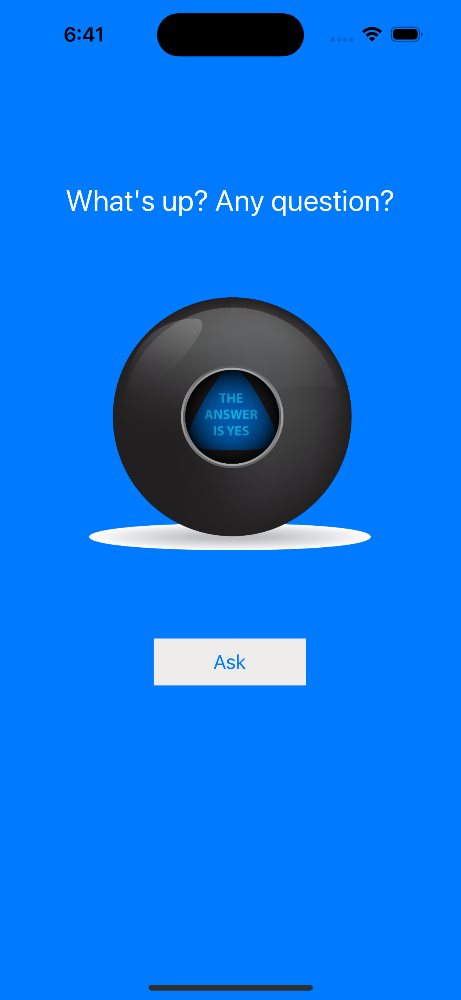

# Questions-App
Do you have any difficult decisions to make? Don't worry! With this application, all of your questions will be answered immediately.

These are a few of the answers you can get:

## Getting Started
To get started with Dice-App, follow these steps:

- Download: Clone or download the repository from our GitHub repository.
- Open in Xcode: Navigate to the downloaded project directory and open the .xcodeproj file in Xcode.
- Run the Application: Build and run the application in Xcode on your iOS device or simulator.
